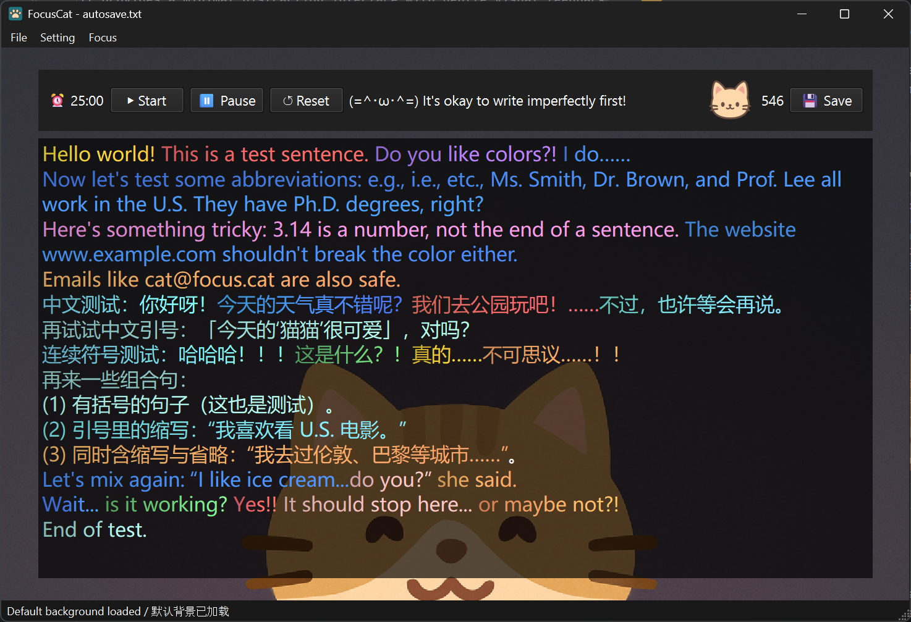

# 😺 FocusCat

**FocusCat** is a lightweight writing companion designed to help users stay focused, relaxed, and motivated during writing sessions.  
It provides a minimal distraction interface with gentle visual feedback and encouraging messages — turning the act of writing into something calm and enjoyable.



---

## ✨ Features

- **Focus Timer** — Divide work into manageable sessions with start, pause, and reset functions.  
- **Dynamic Sentence Colors** — Each sentence appears in a random soft color to make progress more visible and engaging.  
- **Cat Interaction Button** — Click the cat to hear a random meow sound, with total clicks recorded persistently.  
- **Sound Options** — Adjustable volume and toggle for all sound effects in the settings menu.  
- **Customizable Background** — Add your own background image or use the included default dark theme with subtle paw prints.  
- **Motivational Quotes** — Displays cute, supportive phrases during writing to maintain focus and positivity.

---

## ⚙️ How to Run

1. Make sure you have **Python 3.9+** and the following dependencies installed:

   ```bash
   pip install PySide6
   ```

2. Run the program:

   ```bash
   python focuscat_qt.py
   ```

---

## 📁 Project Structure
<!-- PROJECT_STRUCTURE_START -->
```
focuscat_qt/
├── assets
│   ├── images
│   │   ├── bg_1.jpg
│   │   ├── bg_2.jpg
│   │   ├── bg_default.jpg
│   │   ├── cat_meow.png
│   │   ├── cat_normal.png
│   │   └── focuscat_icon.png
│   ├── sounds
│   │   ├── cat-meow-1.wav
│   │   ├── cat-meow-2.wav
│   │   ├── cat-meow-3.wav
│   │   ├── cat-meow-4.wav
│   │   ├── cat-meow-5.wav
│   │   ├── cat-meow-6.wav
│   │   ├── cat-meow-7.wav
│   │   ├── cat-meow-8.wav
│   │   ├── surprise-1.wav
│   │   └── surprise-2.wav
│   └── state
│       └── meow_count.txt
├── readme_imgs
│   └── img.png
├── tools
│   └── tree_gen.py
├── autosave.txt
├── focuscat_qt.py
├── README.md
├── requirements.txt
├── test.txt
└── test_focuscat.py
```
<!-- PROJECT_STRUCTURE_END -->


---

## 🎧 Optional Assets

To customize your experience, you can replace or add your own cat sounds and background images.  
Make sure they are stored inside the `assets/` folder.

### Example:

```
assets/
 ├── background_custom.png
 ├── cat-meow-special1.wav       # Surprise meow sound
 ├── cat-meow-special2.wav    # Another rare sound
```

---

## 🧪 Testing

Unit tests are located in `test_focuscat.py`.  
They cover sentence-splitting, punctuation handling, and gradient color generation.

Run all tests using:

```bash
pytest test_focuscat.py
```

If you are using PyCharm, you can also right-click the test file and choose **Run ‘pytest in test_focuscat.py’**.

---

## ⚙️ Key Functionalities

| Feature                     | Description                                             |
| --------------------------- | ------------------------------------------------------- |
| **Focus Timer**             | Start, pause, and reset a writing timer with a simple interface. |
| **Auto Color Highlighting** | Each sentence gets a random bright color, making progress visually rewarding. |
| **Cat Meow Button**         | Clickable cat icon triggers a random meow sound and increases total click count. |
| **Volume Control**          | Adjust overall sound volume through a slider in the settings. |
| **Background Overlay**      | Automatic dark overlay behind text for better visibility, with adjustable opacity. |
| **Surprise Sounds**         | Extremely rare hidden sounds for fun Easter eggs.       |

---

## 💡 Future Enhancements

- Better UI Design.   
- Save user preferences (theme, font, opacity, etc.).  
- Expand English/Chinese motivational quote sets.  
- Create more sentence colorsets for different background images.
- ......

---

## 📖 Example Quote Text

> “FocusCat reminds you gently: one more sentence, one more thought.”  
> “喵～继续写吧，灵感就在下一个词后面！”

---

## 🧰 Technical Details

- **Language:** Python 3  
- **Framework:** PySide6 (Qt for Python)  
- **UI Design:** Custom QMainWindow layout with QTextEdit, QPushButton, and overlay layers  
- **Data Persistence:** Click count saved to a local text file  
- **Testing:** Built-in `unittest` compatible with `pytest` runner

---

[//]: # ()
[//]: # (## 🧡 Contribution)

[//]: # ()
[//]: # (Pull requests are welcome!  )

[//]: # (If you’d like to improve the cat’s behavior, sound logic, or UI design, feel free to submit a merge request.  )

[//]: # (Please ensure all new features include basic comments and at least one test function.)

[//]: # ()
[//]: # (---)

## 🐾 Author

Created by **Haiqing Bai**.  

[//]: # (FocusCat is designed as a personal productivity and creative exploration project —  )

[//]: # (to make focus *cute*, writing *fun*, and progress *visible*.  )

[//]: # ()
[//]: # (> “The cat meows softly, reminding you that even one sentence is progress.” 🐱)